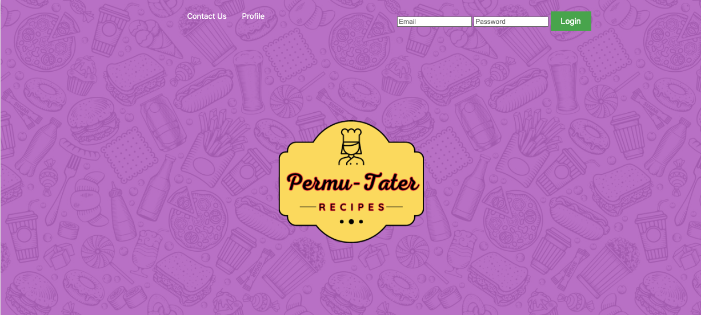
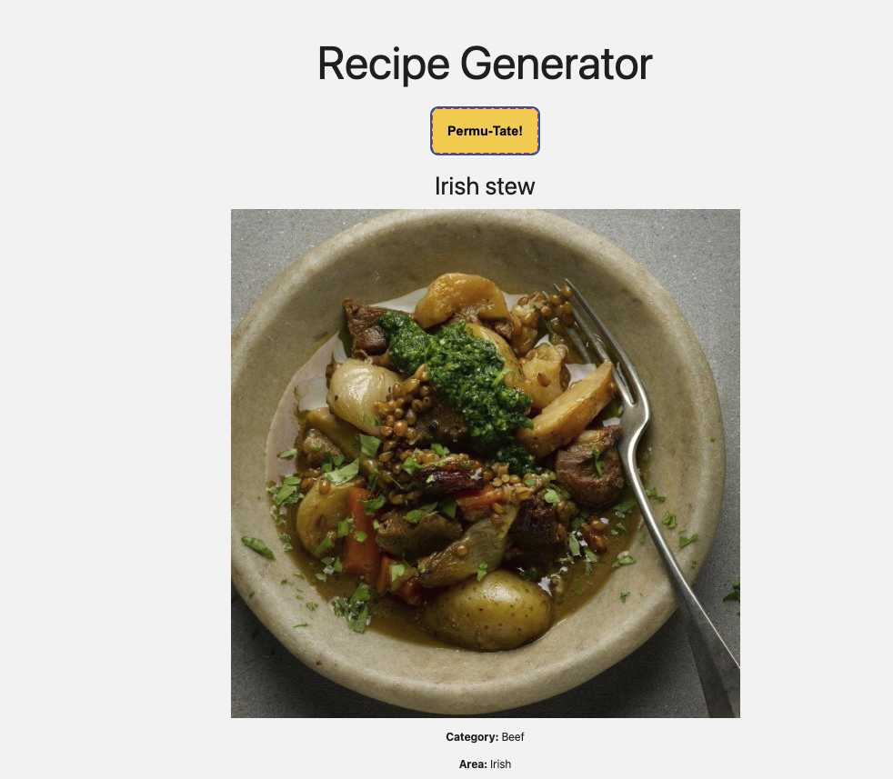

# Permu-Tater

## Description

This webpage provides an interactive platform for finding interesting recipes tailored to your preferences. Whether you're looking for a random recipe or want to customize specific aspects, Permu-Tater has got you covered. Explore an extensive collection of recipes, manage your account, and enjoy a seamless cooking experience.

## Installation

To use Permu-Tater, simply navigate to (https://permu-tater.herokuapp.com/)

## Building Blocks

The following technologies were used to create our Permu-Tater project:

1. Node.js
2. Express.js 
3. Handlebars.js 
4. MySQL
5. Sequelize ORM 
6. Nest.js
7. Mustache/Handlebars
8. Auth 0
10. API key: The MealDB

## Usage

To use Permu-Tater, please follow the following steps: 

1. Navigate to (Website Link Once Deployed) in your web browser.
2. You will be presented with the Permu-Tater Homepage with the option to generate a recipe randomly or with restrictions of your choice.
3. Once you decide to add restrictions or just to go with a random recipe, click the Permu-Tate! button.
4. Now you should have your recipe generated on the webpage.
5. If you decide you want to generate a different receipe, simply click the Permu-Tate! button once again.
6. If you wish to save the recipe you rendered, you will have to ceate an account by going to the Login option at the top right corner of the Navigation bar.

## Features

Permu-Tater contains the following features:

* Random Recipe Generation: Our webpage allow for users to click our Permu-Tate button and a random recipe will appear for their culinary pleasure.
* Step-By-Step Instructions for Each Recipe, Including the Measurements for the Ingredients: Once you render a recipe on the homepage, whether random or specified based on your restrictions, you will also see the instructions and the ingredients you will need in order to cook the deliciousness on the page.

## Future Development Ideas and the Steps You Would Follow to Use These Features

Creating a Profile

1. Once you have navigated to the Login screen, you will need to select the Sign Up option.
2. You will then be presented with a form to input your email and password you wish to use for your profile.
3. Click on the sign up button and you should be re-routed to the homepage while signed into your profile.

Saving a Recipe

1. Make sure you are signed into your profile if you are not already by going to the Login option at the top right corner of the Navigation bar.
2. Once you have rendered a recipe on the Homepage by clicking the Permu-Tate! button, you should see a white star on the right hand side.
3. Simply click on the star to save the recipe. The star should be shaded in with the color Yellow to indicate the recipe is saved to your profile.

## License

## Collaboration
Permu-Tater was a group effort from the following collaborators:
* [Tyler Ross](https://github.com/tylerross5)
* [Will Riffe](https://github.com/Will-Riffe)
* [Samantha Knudsen](https://github.com/knudsam)
* [Elijah Moschella](https://github.com/ElijahMoschella)
* [Jadyn Gomez](https://github.com/Jadyngg19)

